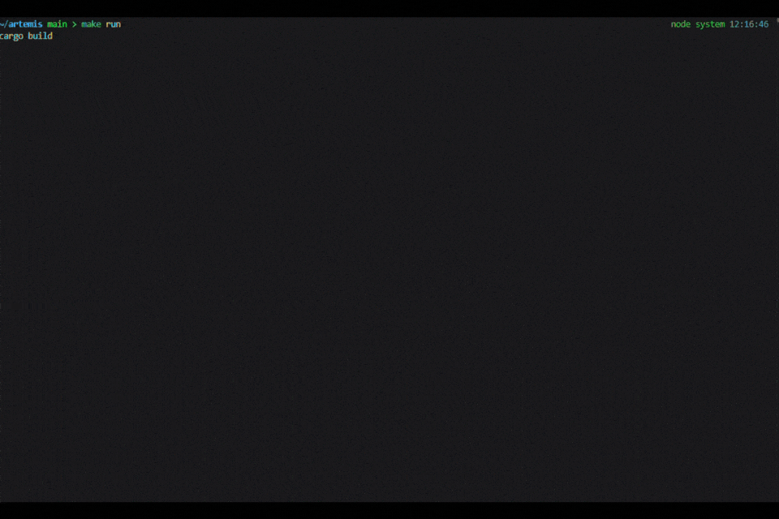

# Artemis

**Real-time C-to-Assembly development tool for learning compiler behavior and systems programming.**

Watch your C code, see the compiled assembly instantly. Edit live, explore optimization effects, understand how code becomes machine instructions.

---

## What is Artemis?

Artemis is an interactive terminal application that synchronizes C source code with its compiled assembly output. Write or modify C in the left pane, watch the x86-64 assembly appear in the right pane in real time. Powered by GCC and built in Rust, it's minimal, fast, and ideal for learning.

## Features

✨ **Live Editing** — Modify C code and see assembly recompile instantly (300ms debounce)  
🎯 **Precise Mapping** — DWARF debug symbols map each C line to its assembly equivalent  
🔦 **Instruction Highlighting** — Cursor-follow mapping highlights the corresponding assembly block  
🔎 **Source Search Mode** — In-editor search with next/previous navigation and viewport-following jumps  
🌙 **Built-in Theme** — "Vantablack" high-contrast color scheme for focused work  
⚡ **Zero Bloat** — Minimal dependencies: just Rust and GCC  
🛡️ **Smart Compilation** — Handles optimization levels, inlining, and real-world patterns

## Quick Start

### Requirements

- Rust toolchain ([rustup.rs](https://rustup.rs))
- GCC with assembly generation support

### Installation & Run

```bash
git clone https://github.com/KarimaTouhami/artemis.git
cd artemis

# Quick start with example
make run

# Or run with your own C file
./target/release/artemis myprogram.c
```

### Build Commands

```bash
make build          # Debug build
make release        # Optimized release build
make clean          # Remove artifacts
```

## Usage

### Starting Artemis

```bash
artemis <source.c>
```

The application opens with your C code on the left and generated assembly on the right. Edit the C code and watch the assembly update in real time.

### Keyboard Controls

**General:**
| Key | Action |
|-----|--------|
| `q` | Quit |
| `?` | Show help |
| `Esc`, then `Tab` / `Shift+Tab` | Switch panes |
| `Ctrl+s` | Save file |
| `r` | Reload from disk |
| `F5` | Toggle follow-mode |

**Search Mode (source pane):**
| Key | Action |
|-----|--------|
| `/` | Enter search query mode |
| `Enter` | Run search and jump to next match from cursor |
| `n` / `N` | Next / previous match |
| `Up` / `Down` | Previous / next match while query mode is open |
| `PgUp` / `PgDn` | Previous / next match while query mode is open |
| `Esc` | Exit search query mode |

**Assembly Pane (when focused):**
| Key | Action |
|-----|--------|
| `j` / `k` | Down / Up |
| `d` / `u` | Fast scroll (5 lines) |
| `f` / `b` | Page down / up |
| `g` / `G` | Jump to top / bottom |

**Source Pane (when focused):**
- Arrow keys for editing
- `PgUp` / `PgDn` to scroll

## How It Works

### C-to-Assembly Synchronization

Artemis uses GCC's DWARF debug information to map C source lines to generated assembly instructions. When you compile with `-g`, GCC embeds `.loc` directives that identify which assembly instructions correspond to each line of C code.

#### Example

```c
int add(int a, int b) {
    return a + b;
}
```

Generates assembly with mapping:

```asm
.loc 1 2 0          <- Line 2 of C file
    movl    %edi, -4(%rbp)
    movl    %esi, -8(%rbp)
.loc 1 3 0          <- Line 3 of C file
    movl    -4(%rbp), %eax
    addl    -8(%rbp), %eax
```

### Mapping Algorithm

1. Parse the generated `.s` file for `.loc` directives
2. Build a map: `C_line → [ASM_line indices]`
3. When cursor is at C line N, highlight corresponding ASM instruction block
4. Handle edge cases: inlining, loop unrolling, optimization effects

### GCC Compilation Flags

Artemis uses these flags for optimal mapping:

```bash
-S                    # Generate assembly only
-masm=intel          # Intel syntax (readable)
-g                   # Emit DWARF debug symbols
-O0                  # No optimization (clearest mapping)
-fno-stack-protector # Skip canary code
```

## Architecture

| Component | Purpose |
|-----------|---------|
| **Core UI** | Ratatui + Crossterm for terminal rendering |
| **File Watcher** | Notify crate monitors source file changes |
| **Compiler** | GCC pipeline for assembly generation |
| **Parser** | DWARF `.loc` directive extraction |
| **Theme** | Custom Vantablack cyberpunk color palette |

## Visual Design

### Vantablack Color Palette

```
VANTABLACK (0, 0, 0)      → Pure black background
NEON_GREEN (0, 255, 65)   → Primary text and code
DIM_GREEN (0, 100, 25)    → Borders and inactive elements
CYBER_CYAN (0, 255, 255)  → Keywords, registers, titles
ALERT_RED (255, 0, 50)    → Errors and warnings
```

### Layout

- **Left Pane**: Editable C source with syntax highlighting
- **Right Pane**: Read-only assembly with instruction highlighting
- **Footer**: Mode indicator, focus, follow-mode state, and assembly scroll/search status

## Development

All build tasks are defined in the Makefile:

```bash
make build      # Build (debug)
make release    # Build (optimized)
make run        # Build and run with example.c
make test       # Run tests
make check      # Check without building
make fmt        # Format code
make clippy     # Run clippy linter
make asm        # Generate assembly from example.c
make clean      # Clean build artifacts
make help       # Show all targets
```

## Implementation Details

Core modules:
- **`main.rs`** — Application entry point and event loop
- **`compiler.rs`** — GCC invocation and `.loc` directive parsing
- **`watcher.rs`** — File monitoring and change detection
- **`highlighter.rs`** — Syntax highlighting and color management

See `compiler.rs::build_loc_instruction_map()` for the mapping algorithm implementation.



## Notes

- Search mode is case-insensitive and supports incremental query updates
- Most accurate results at `-O0`; higher optimization levels may reorder/eliminate instructions
- Best compatibility with x86-64 Linux/macOS systems

## Legal

- Copyright (c) 2026 Karima Touhami.
- Selling or other commercial use requires prior written permission.
- See LICENSE for full terms.

---

**Built with Rust + GCC + Ratatui**